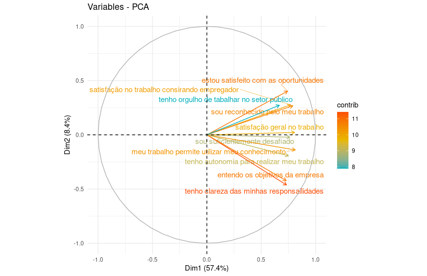

# survey-analysis

## Overview

Este projeto visa analisar pesquisas utilizando análise gráfica de escala Likert e análise de componentes principais.

## Conteúdo do Projeto

1. **Análise Gráfica de Escala Likert:**
   - Utilizamos gráficos para visualizar e interpretar os dados da escala Likert.
   - 

2. **Análise de Componentes Principais:**
   - Aplicamos a análise de componentes principais para identificar padrões e reduzir a dimensionalidade dos dados.
   - 

## Estrutura do Projeto

